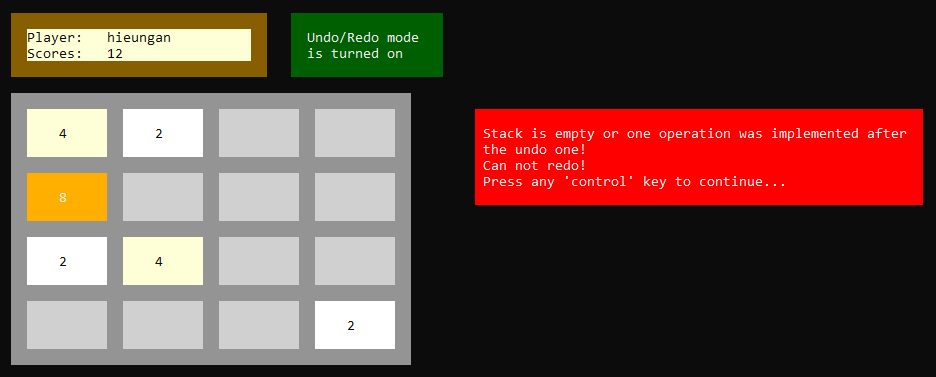
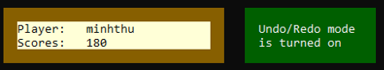
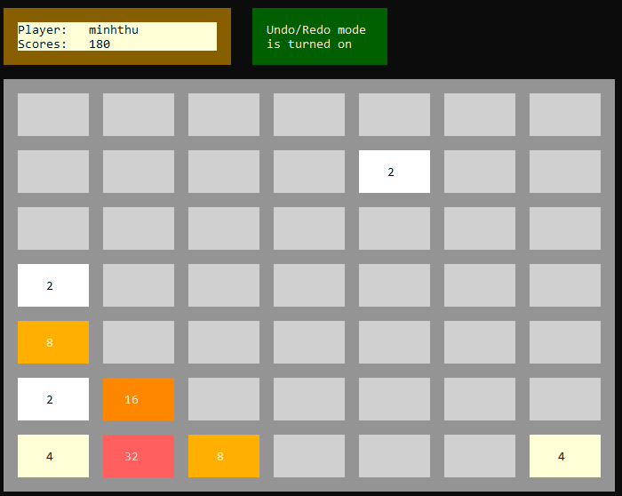

# 2048 GAME

# I. INTRODUCTION

## 1. Author

- Full Name: Nguyễn Thanh Phong
- Student ID: 23120154
- Class: 23CTT2

## 2. Installation
The game and its code are designed to run natively using ***Visual Studio*** on ***Windows*** platforms, with added cross-platform compatibility for macOS.  
To experience the game, users should follow these steps:  
- **Step 1**: Download the source code to your computer.  
- **Step 2**: Extract the `23120154.zip` file and open the `myGame2048.sln` file.  
- **Step 3**: Build and run the program to start playing.

> ***Notes:***  
> - As the program is divided into multiple files, it may take approximately 40 seconds to build and run.  
> - Players must switch to the ***VNI typing method*** to perform movements accurately.  
> - Upon starting the game, the console window will be enlarged for a clear and visually appealing interface.

## 3. Game Rules

In this game, players combine tiles with the same numbers until they reach the value of ***2048***.  
Tiles contain integer values starting from ***2 or 4***, which are powers of 2, such as ***2, 4, 8, 16, 32, 64, 128, etc.***

  

## 4. Completed Features

| Feature                                                                                                        | Completed   |
|----------------------------------------------------------------------------------------------------------------|-------------|
| Display the interface with functionality for two main screens                                                  | x           |
| Implement username input and check for duplicates                                                              | x           |
| Implement board size configuration                                                                             | x           |
| Implement storage of player information                                                                        | x           |
| Implement Resume function                                                                                      |             |
| Implement Exit function                                                                                        | x           |
| Implement game logic such as random generation, movement, game display, score display, etc.                     | x           |
| Implement undo, undo, and redo functions                                                                        | x           |
| Display relevant notifications and content                                                                     | x           |
| Organize code into clear files                                                                                  | x           |
| Use graphical methods with a user-friendly interface                                                            | x           |
| Implement file encryption method                                                                               |             |
| Implement Resume function for five accounts                                                                    |             |

## 5. Built With

- Tool: Visual Studio 2022
- Language: C++
- Operating System: Windows 10

# II. PROJECT DETAILS

## 1. Project Directory

The ***myGame2048*** directory contains the `readme.md` file, a folder with illustrative images for the project, the main source code, and the `myGame2048.sln` file to open the entire project.

## 2. Project Source Code

- `README.md`: Contains all project information, installation instructions, program build steps, and additional notes.  
- `functions.h`: Declares the libraries used in the project, defines ***ANSI ESCAPE CODE*** for coloring objects, and builds structures for stack, player, game state, along with functions related to player information and win/lose screens.  
- `gameLogic.h`: Declares core game functions such as movement and tile merging.  
- `prepareForGame.h`: Declares functions for login preparation to start the game.  
- `undo_redo.h`: Declares functions for reverting to previous states after certain moves.  
- The ***myGame2048*** directory contains the corresponding `.cpp` source files for each function and the binary file `list_top20_players.bin` to store player information.

## 3. 2048 Game Interfaces

- ***Introduction*** screen with color-changing effects:

  

> Color-changing effects and transitions between screens are included.

  

- Upon opening, players are prompted to press ***'Enter'*** to view the 2048 game introduction.

  

- Press ***'Enter'*** to navigate to the ***main window*** of the 2048 game.

  

> ***Notes on selecting menu items***  
- Players use the ***up, down, left, right*** arrow keys (corresponding to ASCII codes ***'72, 80, 75, 77'***) to navigate between menu items and press ***'Enter'*** to select an item.  
- For the ***'Tutorial'*** and ***'Top-20 list'*** items, press ***'Enter'*** to return to the main 2048 game window after completing actions.  
- For the ***'New game'*** item, players must log in and play a game before returning to the main window.  
- For the ***'Game settings'*** item, after selecting sub-items, press ***'Enter'*** once to display a success message, then use the ***up/down arrows*** to navigate to the ***'Go back to main menu screen'*** sub-item and press ***'Enter'*** to return to the main window.

### 3.1. Tutorial

- Players can view instructions on game rules, movement, exiting the game, and other operations.

  

### 3.2. Game Settings

- Players can enable/disable the ***undo/redo*** mode and adjust the 2048 game board size. If not configured initially, the ***undo/redo*** function is ***disabled*** by default, and the board size is set to ***4 x 4***.

  

- When the undo/redo function is enabled, players can ***revert to previous moves*** during gameplay. Attempting to undo beyond the initial state will result in an error.

  

- Similarly, redo allows players to ***return to states undone***. If all undone states are redone, further redo attempts will result in an error. Additionally, if any move is made between undo and redo, redo becomes unavailable, resulting in an error.

  

- When the ***undo/redo*** function is ***enabled***, both undo and redo are allowed. The notification is as follows:

  

- When only the ***undo*** function is enabled, ***redo*** is not allowed. The notification is as follows:

  

- If this section is not configured, the undo/redo function remains ***disabled***. The notification is as follows:

  

- Example of selecting a ***7 x 7*** board size:

  

### 3.3. Top-20 List

- A leaderboard displaying the top 20 players with the highest scores, sorted in descending order. If two players have the same ***score***, the player with the ***shorter playtime*** is ranked higher.

  

### 3.4. New Game

- Players start by logging into an account. The system requires a username and password to record information.  

- A valid username must be ***1 to 14 characters long***, consisting of ***letters, numbers, or a combination of both***, and must not ***duplicate*** any username in the top 20 high-score list.  

- A valid password must not be ***empty*** (i.e., no blank input).  

- Failed login attempts will display error messages:

  

  

- A successful login will display a notification and proceed to the official 2048 game screen:

  

### 3.5. Official Game Screen

- After a successful login, players reach the official 2048 game interface to start playing.  
- Players use the ***'w', 's', 'a', 'd'*** keys to move up, down, left, or right to merge tiles.  
- Use the ***'u'*** key to undo, ***'r'*** to redo, and ***'n'*** to restart with a new game state.  
- To exit before winning or losing, press ***'e'*** for exit, followed by a confirmation prompt: press ***'n'*** to continue playing or ***'y'*** to confirm exit.  
- A notification will prompt players to press ***'Enter'*** to proceed to the end screen.

  

### 3.6. End Screen

  

- Players can officially exit the game by pressing ***'e'*** or continue by registering a new account to play by pressing ***'Enter'***.

> Note: When pressing ***'Enter'*** to continue, players must complete the game session. Afterward, they must press ***'e'*** again to confirm exiting. Memory is fully released only when the program is terminated.

### 3.7. Winning the Game

- When a player reaches a score of 2048, the game ***pauses*** with a congratulatory message.

  

> Example of the win screen interface:

  

- To continue playing, players can press ***control keys*** to keep going until they ***lose*** or choose to ***exit***.

  

### 3.8. Losing the Game

- The game ends when no further moves are possible because the board is filled with distinct tiles.

  

> Example of the lose screen interface:

  

## 4. Information Storage

The list of the top 20 players with the highest scores is stored in the binary file `list_top20_players.bin` in the ***myGame2048*** directory, alongside the `.cpp` source files.

## 5. Project Information Video

- [Video about the 2048 game project](https://drive.google.com/drive/folders/1N995UlKJJ2HTx7n0JJ-24rFjdvwEl71G?q=sharedwith:public%20parent:1N995UlKJJ2HTx7n0JJ-24rFjdvwEl71G).

# III. APPENDIX

## 1. Libraries Used

- `iostream`: Handles data input and output.  
- `ctime`: Provides time-related functions.  
- `cstdlib`: Supports random number generation and mathematical calculations.  
- `conio.h`: Reads key presses and handles asynchronous data.  
- `iomanip`: Enhances data formatting for clarity and readability.  
- `fstream`: Manages file input and output.  
- `sstream`: Simplifies reading strings with special characters.  
- `string`: Enables string usage and built-in string functions.  
- `chrono`: Provides utilities for working with steady clock time and calculating time intervals.  
- `thread`: Manages time threads.  
- `windows.h`: Provides functions specific to the Windows operating system.

## 2. References

- https://gist.github.com/fnky/458719343aabd01cfb17a3a4f7296797  
- https://patorjk.com/software/taag/#p=display&f=Graffiti&t=Type%20Something%20  
- https://stackoverflow.com/questions/48720622/undo-operation-implementation-in-2048-game  
- https://www.quora.com/How-do-I-make-a-2048-game-in-C++-What-is-the-algorithm
