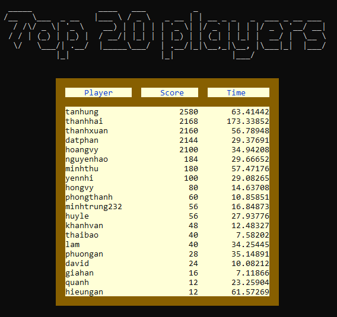

# GAME 2048
---
# I. GIỚI THIỆU
---
## 1. Tác giả

- Họ và tên: Nguyễn Thanh Phong
- MSSV: 23120154
- Lớp: 23CTT2
## 2. Cài đặt
Trò chơi và mã được thiết kế để chạy nguyên bản bằng ***Visual Studio*** trên các nền tảng ***Windows***, nhưng tính tương 
thích đa nền tảng cho MacOS cũng đã được thêm vào.
Để có thể trải nghiệm trò chơi thì người dùng cần cài đặt như sau:
- Bước 1: Tải source code về máy.
- Bước 2: Giải nén tập tin `23120154.zip` và mở tệp `myGame2048.sln`.
- Bước 3: Người chơi sẽ build và run để chơi game.

> ***Lưu ý:***
- Do chương trình được chia nhiều file nên mất khoảng 40 giây để build và run. 
- Người chơi cần chỉnh về ***bộ gõ VNI*** mới có thể thực hiện các bước di chuyển chính xác.
- Khi bắt đầu chơi sẽ phóng to màn hình console để có giao diện dễ nhìn và đẹp mắt.

## 3. Luật chơi 

Trong trò chơi này, người chơi kết hợp các ô có cùng số cho đến khi đạt được giá trị ***2048***. 
Các ô chỉ chứa các giá trị nguyên bắt đầu từ ***2 hoặc 4***, hoặc ***2 và 4***
là các lũy thừa của 2, chẳng hạn như ***2, 4, 8, 16, 32, 64, 128, v.v.***

  

## 4. Các chức năng hoàn thành 

| Chức năng                                                                                                      | Hoàn thành  |
|----------------------------------------------------------------------------------------------------------------|-------------|
| Hiển thị được giao diện kèm chức năng của hai màn hình chính                                                   | x           |
| Thực hiện được chức năng nhập tên và kiểm tra tính trùng lắp                                                   | x           |
| Thực hiện được chức năng cài đặt độ lớn của bàn cờ                                                             | x           |
| Thực hiện được việc lưu trữ thông tin người chơi                                                               | x           |
| Thực hiện được chức năng Resume                                                                                |             |
| Thực hiện được chức năng Exit                                                                                  | x           |
| Thực hiện được logic trong trò chơi như phát sinh ngẫu nhiên, di chuyển, hiển thị trò chơi, hiển thị điểm, v.v | x           |
| Thực hiện được chức năng undo, undo và redo                                                                    | x           |
| Hiển thị các thông báo và nội dung tương ứng                                                                   | x           |
| Tổ chức thành các file rõ ràng                                                                                 | x           |
| Có sử dụng phương thức đồ hoạ kèm giao diện thân thiện                                                         | x           |
| Cài đặt được cách thức mã hoá tệp tin                                                                          |             |
| Cài đặt được chức năng Resume cho năm tài khoản                                                                |             |

---
## 5. Xây dựng bởi 

- Công cụ: Visual Studio 2022
- Ngôn ngữ: C++;
- Hệ điều hành: Window 10 

# II. CHI TIẾT VỀ ĐỒ ÁN

## 1. Thư mục dự án 

Thư mục ***myGame2048*** sẽ chứa tập tin `readme.md`, thư mục ảnh minh hoạ cho dự án,
mã nguồn chính và tập tin `myGame2048.sln` để mở toàn bộ dự án.

## 2. Mã nguồn dự án

- `README.md` để ghi tất cả thông tin về dự án, cách cài đặt, build chương trình cùng một số
lưu ý khác.
- `funtions.h` dùng để khai báo các các thư viện cần sử dụng cho dự án, định nghĩa các mã 
***ANSI ESCAPE CODE*** to màu sắc cho các đối tượng trong dự án. Bên cạnh đó còn khai báo và xây dựng
cấu trúc cho stack, người chơi, trạng thái game cùng một số hàm liên quan đến thông tin người 
chơi và màn hình thắng - thua game.
- `gameLogic.h`dùng để khai báo các hàm cốt lõi cho game như di chuyển, hợp nhất các ô...
- `prepareForGame.h` dùng để khai báo các hàm thao tác chuẩn bị đăng nhập để bắt đầu chơi.
- `undo_redo.h`để khai báo các hàm chức năng quay lại trạng thái trước đó sau một số nước đi
nhất định.
- Thư mục ***myGame2048*** sẽ chứa các mã nguồn `.cpp` tương ứng với từng hàm trong dự án và
tập tin nhị phân `list_top20_players.bin` để lưu trữ thông tin người chơi.

## 3. Các giao diện game 2048

- Màn hình ***giới thiệu*** cùng hiệu ứng thay đổi màu sắc: 

  

> Sẽ có hiệu hứng thay đồi màu sắc và hiệu ứng chuyển cảnh giữa các màn hình 
với nhau. 

  

- Khi mở màn, người chơi sẽ được yêu cầu nhấn phím ***'Enter'*** để xem phần giới thiệu game 2048.

  

- Người chơi nhấn ***'Enter'*** để đi đến ***cửa sổ chính*** game 2048.

  

> ***Lưu ý khi chọn các chỉ mục*** 
- Người chơi sẽ thực hiện các thao tác nhấn mũi tên ***"lên, xuống, trái, phải"*** ứng
với mã ASCII ***'72, 80, 75, 77'*** để di chuyển giữa các chỉ mục.
và nhấn ***'Enter'*** để biểu thị mình đã chọn chỉ mục đó. Sau khi hoàn thành các thao tác
trong chỉ mục đã chọn, thì nếu là chỉ mục ***'Tutorial'*** và ***'Top-20 list'*** thì người chơi 
chỉ cần nhấn ***'Enter'*** để quay lại cửa sổ chính game 2048.
- Đối với các thao tác trong chỉ mục ***'New game'*** thì người chơi buộc phải đăng nhập tài khoản
rồi chơi, sau ván chơi đó mới quay trở lại cửa sổ chính game 2048.
- Đối với chỉ mục ***'Game settings'***, sau mỗi lần chọn các chỉ mục con của ***'Game settings'***
thì nhấn ***'Enter'*** chỉ 1 lần để hiện thông báo thao tác thành công, sau đó cần dùng các ***'mũi tên lên/ xuống'*** 
để di chuyển đến chỉ mục con ***'Go back to main menu screen'*** rồi mới nhấn ***'Enter'*** để quay
lại cửa sổ chính game 2048.

### 3.1. Tutorial  

- Người chơi được xem hướng dẫn luật chơi và cách di chuyển, cách thoát game và các thao tác khác.

  

### 3.2. Game settings  

- Người chơi sẽ cài đặt chế độ ***undo/ redo*** và điều chỉnh kích thước bảng trò chơi 2048. Nếu
ban đầu người chơi không vào phần cài đặt này thì chức năng ***undo/redo*** mặc định sẽ ***tắt***
và kích thước bảng mặc định là ***4 x 4***.

  

- Sau khi bật chức năng undo/redo thì trong quá trình chơi, người chơi
có thể ***quay lại các nước đi trước đó***. Khi undo lại trạng thái ban đầu thì
không thể undo được nữa, nếu không sẽ báo lỗi.

  

- Tương tự với undo, redo sẽ ***quay lại trạng thái vừa undo***, khi 
quay lại hết trạng thái undo thì không thể redo được nữa. Hơn nữa
nếu có bất kỳ bước di chuyển nào ***chèn giữa*** undo và redo thì cũng 
không thể redo được. Nếu không sẽ báo lỗi.

  

- Sau khi ***bật*** chức năng undo/redo thì ***được phép*** undo và redo. 
Thông báo như sau:

  

- Sau khi ***bật*** chức năng undo thì ***chỉ được phép*** undo trong lúc chơi,
***không cho phép*** redo. Thông báo như sau:

  

- Nếu ***không*** cài đặt phần này thì chức năng undo/redo sẽ
***tắt***. Thông báo như sau:

  

- Ví dụ sau khi chọn kích thước bảng ***7 x 7***

  

### 3.3. Top-20 list

- Bảng xếp hạng 20 người chơi có số điểm cao nhất giảm dần từ trên 
xuống dưới. Nếu có 2 người chơi nào có số ***điểm trùng nhau*** thì ai có 
thời gian chơi ***ít hơn*** thì họ sẽ được xếp ở ***top cao hơn***.

  

### 3.4. New game  

- Người chơi bắt đầu đăng nhập tài khoản để chơi. Hệ thống yêu cầu người chơi nhập 
tên tài khoản và mật khẩu để ghi nhận thông tin. 

- Tên đăng nhập hợp lệ khi thoả mãn có ***độ dài từ 1 đến 14 ký tự***, bao gồm kí tự trong 
bảng ***chữ cái hoặc chữ số hoặc kết hợp cả hai***. Đồng thời, tên người chơi mới không được
phép ***trùng*** với người chơi trước đang nằm trong top 20 người chơi có điểm số cao nhất.

- Mật khẩu hợp lệ thì không được ***bỏ trống***
(tức ký tự rỗng).

- Đăng nhập không thành công sẽ xuất hiện các thông báo lỗi: 

  

  

- Đăng nhập thành công sẽ hiện thông báo và đi đến màn hình game 2048 
chính thức:

  

### 3.5. Màn game hình chính thức

- Người chơi sau khi đăng nhập thành công sẽ đến giao diện chính thức
game 2048 để bắt đầu chơi.
- Người chơi sẽ dùng các phím mũi tên ***'w','s','a','d'*** để di chuyển lên, xuống, 
trái, phải để gộp các ô lại với nhau.
- Sử dụng phím **'u'** để undo, phím ***'r'*** để redo và phím ***'n'*** để restart khởi tạo
trạng thái game mới. 
- Nếu đang chơi mà người chơi muốn thoát trước khi thắng hoặc thua
thì nhấn phím ***'e'*** đại diện cho exit. Sau đó có bảng xác nhận thoát game
bằng cách nhấn ***'n'*** nếu không muốn thoát và tiếp tục chơi, ngược lại
nếu nhấn ***'y'*** tức đồng ý thoát game.
- Xuất hiện thông báo yêu cầu người chơi nhấn ***'Enter'*** để đi tới màn hình
kết thúc.

  

### 3.6. Màn hình kết thúc:

  

- Lúc này người chơi sẽ thoát chính thức cả trò chơi bằng cách nhấn **'e'**,
hoặc tiếp tục bằng cách đăng ký tài khoản mới để chơi bằng cách nhấn ***'Enter'***.

> Lưu ý khi nhấn ***'Enter'*** để chơi tiếp thì phải chơi đến hết ván game của mình. Sau đó cũng 
phải nhấn e để xác nhận thoát game 1 lần nữa. Chỉ khi thoát chương trình thì bộ nhớ mới được
hoàn toàn giải phóng. 
### 3.7. Thắng game

- Khi người chơi đạt đến số điểm 2048 thì ***tạm dừng*** ván đó với câu chúc mừng. 

  

> Ví dụ minh hoạ giao diện thắng game

  

- Người chơi nếu muốn chơi tiếp thì nhấn các ***phím điều khiển*** để tiếp tục chơi đến khi
***thua*** hoặc đến khi người chơi ***nhấn exit*** để dừng.

  

### 3.8. Thua game

- Khi người chơi không thể di chuyển thêm bước nào được nữa do bảng đã đầy kín các ô đôi một
khác nhau. Ván chơi kểt thúc.

  

> Ví dụ minh hoạ giao diện thua game

  

## 4. Lưu trữ thông tin

Danh sách top 20 người chơi có điểm cao nhất sẽ được lưu trữ trong tập tin nhị phân
`list_top20_players.bin` trong thư mục ***myGame2048***, nằm cùng thư mục với các mã nguồn
`.cpp`.

## 5. Video các thông tin về đồ án

- [Video về đồ án game 2048](https://drive.google.com/drive/folders/1N995UlKJJ2HTx7n0JJ-24rFjdvwEl71G?q=sharedwith:public%20parent:1N995UlKJJ2HTx7n0JJ-24rFjdvwEl71G).

---

# III. PHỤ LỤC

---
## 1. Các thư viện sử dụng

- `iostream` để xử lý nhập xuất dữ liệu.
- `ctime` cung cấp các hàm liên quan đến thời gian.
- `cstdlib` để sinh số ngẫu nhiên, tính toán số học.
- `conio.h` để đọc phím bấm, xử lý dữ liệu không đồng bộ.
- `iomanip` giúp việc định dạng dữ liệu rõ ràng và dễ nhìn hơn
- `fstream` để xử lý nhập xuất file.
- `sstream` để đơn giản việc đọc chuỗi gồm các ký tự đặc biệt.
- `string` để có thể sử dụng chuỗi và các hàm đã cài đặt sẵn cho chuỗi.
- `chrono` cung cấp các tiện ích để làm việc với thời gian đồng hồ (steady clock),
tính toán khoảng thời gian giữa hai thời điểm.
- `thread` để quản lý luồng thời gian. 
- `windows.h`để có thể sử dụng các hàm chỉ riêng cho hệ điều hành Window.

## 2. Tài liệu tham khảo

- https://gist.github.com/fnky/458719343aabd01cfb17a3a4f7296797
- https://patorjk.com/software/taag/#p=display&f=Graffiti&t=Type%20Something%20
- https://stackoverflow.com/questions/48720622/undo-operation-implementation-in-2048-game
- https://www.quora.com/How-do-I-make-a-2048-game-in-C++-What-is-the-algorithm
---